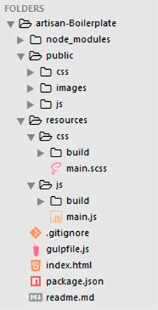

# ARTISAN BOILER PLATE
----------------------

- BOILERPLATE PARA DESENVOLVIMENTO WEB

*Simples Boilerplate feito para facilitar e acelerar seu desenvolvimento.*

- Gulp
- Sass/Scss
- Uglify
- Plumber
- live-server

## ESTRUTURA DE PASTAS
----------------------

## INSTALAÇÃO
-------------

	- npm init
	- npm i --save-dev gulp
	- npm i --save-dev gulp-sass
	- npm i --save-dev gulp-uglify
	- npm i --save-dev gulp-plumber
	- npm i --save-dev live-server

## EXECUTANDO COMANDOS
----------------------

	- "gulp scripts" executa o comando para compilar a pasta JS e rodas as tarefas 'scripts' (plumber e uglify)
	- "gulp styles" executa o comando para compilar o SCSS em CSS da pasta resources/css para public/css
	- "gulp html" executa o comando para subir um servidor localhost na porta 4040 || 8080
	- "gulp watch" executa o comando para vigiar se algum arquivo css/js foi alterado, assim compilando os mesmo.
	- "gulp" executa todas tarefas ao mesmo instante.

			

